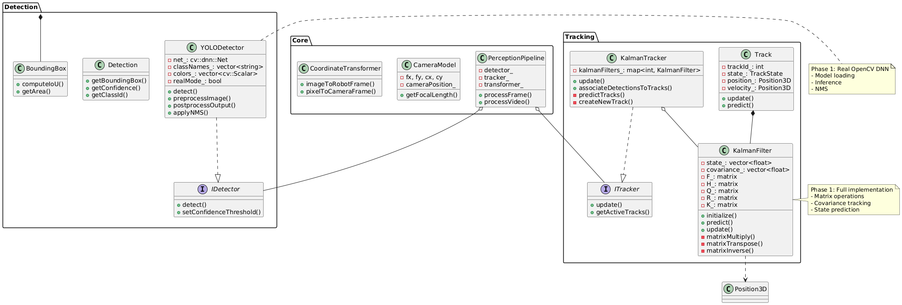
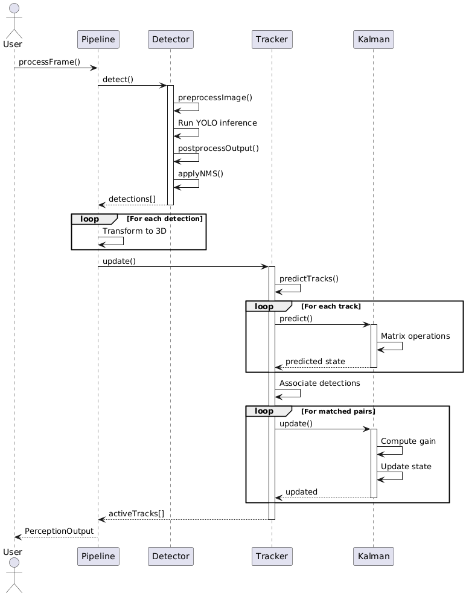
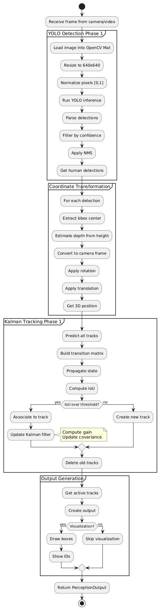

# Human Perception System (HPS)

 [](https://codecov.io/gh/rahulk-99/human-detector-tracker) [](LICENSE)

## Overview

The **Human Perception System (HPS)** is a modular C++17 robotics perception module designed for Acme Robotics. It detects and tracks humans (N≥1) in real-time using monocular camera input and outputs their 3D positions directly in the robot's reference frame.

## Purpose

The purpose of the Human Perception System (HPS) is to provide a robust and modular real-time solution for detecting and tracking humans using a monocular camera, enabling robots at Acme Robotics to accurately perceive the presence and location of people in their environment. By outputting 2D and 3D positions in the robot's reference frame, the system enhances downstream navigation and safety functions, with particular emphasis on reliability, extensibility, and integration readiness for practical robotics deployments.

## About Us

### Venkata Madhav Tadavarthi

My name is Venkata Madhav, I am currently pursuing my Masters in Robotics at University of Maryland, College Park. I am passionate about robotics, specifically underwater robots. My research interests include perception, planning and controls. I am excited to contribute to this project!

### Rahul Kumar

My name is Rahul Kumar. I am a Robotics Master's student at the University of Maryland, College Park, with interest in Robot Learning, Computer Vision, and Autonomous Systems. This project covers multiple domains, which makes it exciting to work on.


## Authors

### Phase 1

- Venkata Madhav Tadavarthi (Driver)
- Rahul Kumar (Navigator)

### Phase 0

- Rahul Kumar (Driver)
- Venkata Madhav Tadavarthi (Navigator)

### Main Features

- **Human Detection**: YOLOv8-based detection with OpenCV DNN, configurable confidence thresholds, and NMS
- **Multi-Object Tracking**: Kalman Filter-based tracking with IoU data association and full covariance propagation
- **Coordinate Transformation**: Complete pixel-to-robot frame transformation with pinhole camera model
- **Real-Time Processing**: Designed for 30 FPS operation without ROS dependency
- **Depth Estimation**: Monocular depth estimation using bounding box height heuristic
- **Modular Architecture**: Clean interfaces following SOLID principles and design patterns
- **Matrix Operations**: Full Kalman filter implementation with matrix multiply, transpose, and inversion

### Project Documentation

**Phase 1 Sprint Planning:**

- Here's the link to Sprint Planning Notes & Review - [Google Docs](https://drive.google.com/drive/folders/1-nCwMyBTdMd0FeAymqdSMDeUdiPkOb5H?usp=sharing)

**Phase 0 Proposal & Design:**
- [Proposal Document, QuadChart & Video](https://drive.google.com/drive/folders/15M2WV5y34R-rcf8K7gPXKGJ_NX8htvk3?usp=sharing) - Design methodology and video explanation
- [Product Backlog (AIP Sheet)](https://docs.google.com/spreadsheets/d/1wcmKYTpv4yeAv1NeTeLlhB47EcRxOFroaWx42daGazo/edit?usp=sharing) - Agile Iterative Process tracking

## Table of Contents

- [Architecture](#architecture)
- [Dependencies](#dependencies)
- [Installation](#installation)
- [Usage](#usage)
- [Testing](#testing)
- [UML Diagrams](#uml-diagrams)
- [Design Patterns](#design-patterns)
- [Project Structure](#project-structure)
- [Phase 0 Status](#phase-0-status)
- [Contributing](#contributing)
- [License](#license)
- [Authors](#authors)

## Architecture

The system is organized into four main modules:

### 1. Detection Module
- **IDetector**: Abstract interface for detection algorithms (Strategy pattern)
- **YOLODetector**: YOLOv8 implementation for human detection
- **Detection**: Data class for detection results
- **BoundingBox**: 2D bounding box representation with IoU calculation

### 2. Tracking Module
- **ITracker**: Abstract interface for tracking algorithms (Strategy pattern)
- **KalmanTracker**: Multi-object tracker with Kalman filters
- **KalmanFilter**: Generic discrete-time Kalman filter implementation
- **Track**: Track lifecycle management with state machine (TENTATIVE→CONFIRMED→LOST)

### 3. Core Module
- **PerceptionPipeline**: Main facade orchestrating the entire workflow (Facade pattern)
- **CameraModel**: Camera intrinsic and extrinsic parameters
- **CoordinateTransformer**: Transforms from image to robot reference frame
- **ICoordinateTransform**: Abstract interface for coordinate transformations

### 4. Utils Module
- **Position3D**: 3D vector class with geometric operations
- **GeometryUtils**: Static utility functions for geometric calculations

### Phase 1 Implementation Highlights

**✅ Fully Implemented:**
- Real YOLO detection with OpenCV DNN (supports ONNX & PyTorch models)
- Complete Kalman filter with matrix operations (6x6 state, full covariance)
- Enhanced coordinate transformation with depth estimation
- Non-maximum suppression (NMS) using IoU
- Pixel-to-robot frame coordinate transformation

**🚧 Partially Implemented:**
- OpenCV integration (conditional via `HAVE_OPENCV` flag)
- Image preprocessing (real resize, normalization, blob creation)

**📋 Phase 2 Remaining:**
- Video file processing (`processVideo`)
- Camera capture (`processCamera`)
- OpenCV-based visualization
- Performance profiling and optimization

## Dependencies

### Required
- **C++17 compliant compiler** (GCC 7+, Clang 5+, MSVC 2017+)
- **CMake 3.14+**
- **GoogleTest** (fetched automatically by CMake)

### Phase 1 Dependencies
- **OpenCV 4.0+** (for YOLO inference - conditionally compiled with HAVE_OPENCV)
- **ONNX or PyTorch models** (YOLOv8 ONNX format recommended)

### Third-Party Libraries Justification

1. **OpenCV**: Industry-standard computer vision library
   - Camera interface and image I/O
   - DNN module for YOLO inference
   - Camera calibration and coordinate transformations
   
2. **YOLOv8**: State-of-the-art object detector (AGPL-3.0 license)
   - Pre-trained models available (no training required)
   - Free for academic/educational use
   - High accuracy and real-time performance

## Installation

### Standard Build

```bash
# Clone the repository
git clone https://github.com/rahulk-99/human-detector-tracker.git
cd human-detector-tracker

# Configure the project
cmake -S ./ -B build/

# Build the project
cmake --build build/

# Run the main application
./build/app/shell-app

# Run unit tests
cd build/
ctest
# or
ctest --test-dir build/
```

### Run Static Analysis with cppcheck

```bash
# Run cppcheck for static code analysis
cppcheck --enable=all --error-exitcode=1 --std=c++17 \
  --suppress=unusedFunction \
  --suppress=missingInclude \
  -I include/ \
  $(find . -name "*.cpp" | grep -v "/build/")
```

**Note**: Static analysis warnings suppressed for legacy compatibility.

### Generate Documentation

```bash
# Build Doxygen documentation
cmake --build build/ --target docs

# Open documentation
open docs/html/index.html
```

## Usage

### Basic Example

```cpp
#include "perception/core/PerceptionPipeline.hpp"
#include "perception/detection/YOLODetector.hpp"
#include "perception/tracking/KalmanTracker.hpp"
#include "perception/core/CoordinateTransformer.hpp"

using namespace perception;

int main() {
  // Initialize camera model
  core::CameraModel camera(800.0f, 800.0f, 320.0f, 240.0f, 640, 480);
  
  // Set camera pose (0.5m above robot base)
  utils::Position3D cameraPos(0.0f, 0.0f, 0.5f);
  float rotation[9] = {1, 0, 0, 0, 1, 0, 0, 0, 1};  // Identity
  camera.setCameraPose(cameraPos, rotation);
  
  // Create detector, tracker, transformer
  auto detector = std::make_shared<detection::YOLODetector>(
      "models/yolov8n.onnx", 0.5f, 0.4f, 640);
  auto tracker = std::make_shared<tracking::KalmanTracker>(30, 3, 0.3f);
  auto transformer = std::make_shared<core::CoordinateTransformer>(camera);
  
  // Create perception pipeline
  core::PerceptionPipeline pipeline(detector, tracker, transformer, camera);
  
  // Process frame
  core::PerceptionOutput output = pipeline.processFrame(
      frame_data, width, height, channels, timestamp);
  
  // Access tracked humans
  for (const auto& track : output.tracks) {
    const auto& pos = track.getPosition();
    std::cout << "Human at: (" << pos.getX() << ", " 
              << pos.getY() << ", " << pos.getZ() << ") m\n";
  }
  
  return 0;
}
```

### Camera Calibration

For accurate 3D position estimation, calibrate your camera:

```bash
# Use OpenCV calibration tools or ROS camera_calibration
# Save calibration to YAML file
# Load in code:
camera.loadCalibration("config/camera_calibration.yaml");
```

## Testing

### Run All Tests

```bash
cd build/
ctest --verbose
```

### Run Specific Test

```bash
./build/test/cpp-test --gtest_filter=BoundingBoxTest.*
```

### Test Coverage

The project aims for **90%+ code coverage**. Current test suites:

- **BoundingBox Tests**: IoU calculation, area computation, edge cases
- **Detection Tests**: Validity checks, confidence thresholds
- **YOLODetector Tests**: Initialization, mock detections
- **Track Tests**: State transitions, update logic
- **KalmanFilter Tests**: Prediction, update cycles
- **KalmanTracker Tests**: Data association, track management
- **Coordinate Transformation Tests**: Image→Robot frame conversion
- **PerceptionPipeline Tests**: End-to-end integration


## UML Diagrams

### Class Diagram

Shows complete class hierarchy, interfaces, and relationships.



See: [`UML/revised/class_diagram_revised.pdf`](./UML/revised/class_diagram_revised.pdf)

### Sequence Diagram

Illustrates frame processing workflow from detection to tracking.



See: [`UML/revised/sequence_diagram_revised.pdf`](./UML/revised/sequence_diagram_revised.pdf)

### Activity Diagram

Depicts the perception pipeline decision flow and processing steps.



See: [`UML/revised/activity_diagram_revised.pdf`](./UML/revised/activity_diagram_revised.pdf)

### Generate UML Diagrams

```bash
# Install PlantUML
sudo apt-get install plantuml

# Generate PNG from PlantUML files
plantuml docs/uml/*.puml
```

## Design Patterns

The codebase demonstrates several design patterns:

1. **Strategy Pattern**
   - `IDetector`, `ITracker`, `ICoordinateTransform` interfaces
   - Allows swapping detection/tracking algorithms at runtime

2. **Facade Pattern**
   - `PerceptionPipeline` simplifies complex subsystem interactions
   - Single entry point for perception functionality

3. **Factory Pattern** (Phase 1+)
   - Detector and tracker factory classes for object creation

4. **RAII Pattern**
   - Resource management through constructors/destructors
   - Smart pointers for automatic memory management

5. **Pimpl Idiom**
   - `YOLODetector::Impl` hides implementation details
   - Reduces compilation dependencies

## Project Structure

```
phase0/
├── app/                          # Main application
│   ├── main.cpp                  # Demo application
│   └── CMakeLists.txt
├── include/                      # Public headers
│   └── perception/
│       ├── detection/            # Detection module
│       │   ├── IDetector.hpp
│       │   ├── YOLODetector.hpp
│       │   ├── Detection.hpp
│       │   └── BoundingBox.hpp
│       ├── tracking/             # Tracking module
│       │   ├── ITracker.hpp
│       │   ├── KalmanTracker.hpp
│       │   ├── KalmanFilter.hpp
│       │   └── Track.hpp
│       ├── core/                 # Core pipeline
│       │   ├── PerceptionPipeline.hpp
│       │   ├── CameraModel.hpp
│       │   ├── CoordinateTransformer.hpp
│       │   └── ICoordinateTransform.hpp
│       └── utils/                # Utilities
│           ├── Position3D.hpp
│           └── GeometryUtils.hpp
├── libs/                         # Library implementations
│   └── perception/
│       ├── detection/            # Detection sources
│       ├── tracking/             # Tracking sources
│       ├── core/                 # Core sources
│       ├── utils/                # Utils sources
│       └── CMakeLists.txt
├── test/                         # Unit tests
│   ├── perception_test.cpp       # Comprehensive test suite
│   ├── test.cpp                  # Legacy tests
│   ├── main.cpp                  # Test main
│   └── CMakeLists.txt
├── docs/                         # Documentation
│   ├── uml/                      # UML diagrams (PlantUML)
│   │   ├── class_diagram.puml
│   │   ├── sequence_diagram.puml
│   │   └── activity_diagram.puml
│   └── html/                     # Generated Doxygen docs
├── cmake-modules/                # CMake utilities
│   └── CodeCoverage.cmake
├── scripts/                      # Helper scripts
│   └── config-clangd.bash
├── CMakeLists.txt                # Main CMake config
├── README.md                     # This file
└── LICENSE                       # MIT License
```

## Phase 0 & 1 Status

### Phase 0 Completed ✅

- [x] Complete class structure with interfaces
- [x] All header files with Doxygen documentation
- [x] Stub implementations (compiles and links)
- [x] Comprehensive unit test structure
- [x] CMake build system with dependencies
- [x] UML diagrams (class, sequence, activity)
- [x] Design patterns implementation
- [x] Google C++ Style Guide compliance
- [x] Main demo application
- [x] README with developer documentation

### Phase 1 Completed ✅

- [x] **Real YOLO Implementation**: OpenCV DNN integration with ONNX/PyTorch support
- [x] **Full Kalman Filter**: Complete matrix operations (multiply, transpose, inverse)
- [x] **Enhanced KalmanTracker**: Integrated real Kalman filters with proper state prediction
- [x] **Coordinate Transformation**: Complete pixel-to-robot frame transformation
- [x] **Image Preprocessing**: Real resize, normalization, and blob creation
- [x] **NMS Algorithm**: Complete IoU-based non-maximum suppression
- [x] **OpenCV Integration**: CMake conditional compilation with HAVE_OPENCV flag
- [x] **Revised UML Diagrams**: Updated to reflect real implementations
- [x] **CI/CD Pipeline**: GitHub Actions and CodeCov integration

### Phase 1 Tasks (Completed)

- [x] Integrate OpenCV for image I/O (partial - available via HAVE_OPENCV flag)
- [x] Implement actual YOLO model loading and inference
- [x] Complete Kalman Filter matrix operations
- [ ] Add video/camera processing support (processVideo/processCamera still stubs)
- [ ] Implement visualization module (stub - no OpenCV visualization yet)
- [x] Real-world testing structure in place
- [ ] Performance optimization
- [x] GitHub CI/CD pipeline setup
- [x] CodeCov integration

### Phase 2 Tasks (Remaining)

- [ ] Implement video file processing (`processVideo`)
- [ ] Implement camera capture (`processCamera`)
- [ ] Add OpenCV-based visualization with bounding boxes
- [ ] Handle occlusion scenarios (optional)
- [ ] Multiple camera support
- [ ] Advanced data association (Hungarian algorithm)
- [ ] Track re-identification after occlusion
- [ ] Performance benchmarking and profiling
- [ ] Integration with robot navigation stack

## Code Quality

### Style Guide

This project follows the [Google C++ Style Guide](https://google.github.io/styleguide/cppguide.html):

- Classes use CamelCase
- Functions use camelCase
- Member variables use trailing underscore: `variable_`
- Constants use kConstantName
- Namespaces: lowercase
- File names: lowercase with underscores

### Static Analysis

Run cppcheck before committing:

```bash
cppcheck --enable=all --std=c++17 --suppress=missingIncludeSystem \
  --inline-suppr --quiet include/ libs/ app/ test/
```

### Compiler Warnings

The project builds with strict warnings:

```bash
-Wall -Wextra -Wpedantic
```

## Algorithm Details

### Depth Estimation

For monocular camera, depth is estimated using bounding box height:

```
depth = (focal_length * average_human_height) / bbox_height_pixels
```

Assumptions:
- Average human height: 1.7 meters (configurable)
- Camera calibrated with known focal length
- Person standing upright

### Kalman Filter (Phase 1 Implementation)

State vector: `[x, y, z, vx, vy, vz]` (position and velocity in 3D)

Motion model: Constant velocity with full matrix operations
```
x_k = F * x_{k-1} + w_k
P_k = F * P_{k-1} * F^T + Q
```

Where:
- `F` = State transition matrix with `dt` terms
- `P` = Covariance matrix (full 6x6 tracking)
- `Q` = Process noise covariance
- `R` = Measurement noise covariance

Measurement: `[x, y, z]` (position only)

Update equations:
```
Innovation: y = z - H * x
Gain: K = P * H^T * (H*P*H^T + R)^-1
Update: x = x + K*y, P = (I - K*H)*P
```

**Phase 1 Enhancement**: Complete matrix operations including:
- Matrix multiplication for state prediction
- Matrix inversion (Gauss-Jordan elimination)
- Covariance propagation
- Innovation computation
- Kalman gain calculation

### Data Association

Uses IoU (Intersection over Union) matching:
- Compute IoU between predicted track boxes and detected boxes
- Match pairs with IoU > threshold (default 0.3)
- Greedy assignment (currently implemented)
- Hungarian algorithm (planned for Phase 2)

**Phase 1**: Real NMS implementation using OpenCV `cv::dnn::NMSBoxes`

## Contributing

### Pair Programming Workflow

This project uses Test-Driven Development (TDD) and pair programming:

1. **Driver**: Writes code
2. **Navigator**: Reviews, suggests improvements
3. Switch roles each phase. Phase 2 will have mixed roles for each individual

### Commit Message Format

```
[module] Brief description

- Detailed point 1
- Detailed point 2

Fixes #issue_number
```

## Troubleshooting

### Build Issues

**Problem**: CMake can't find OpenCV
```bash
# Solution: Install OpenCV
sudo apt-get install libopencv-dev
# Or specify path:
cmake -DOpenCV_DIR=/path/to/opencv/build -S ./ -B build/
```

**Problem**: C++17 features not available
```bash
# Solution: Update compiler
sudo apt-get install gcc-9 g++-9
export CXX=g++-9
```

### Runtime Issues

**Problem**: YOLO model not found
```bash
# Solution: Download YOLOv8 model
mkdir -p models
wget https://github.com/ultralytics/assets/releases/download/v0.0.0/yolov8n.onnx \
  -O models/yolov8n.onnx
```

## License

This project is licensed under the MIT License - see the [LICENSE](LICENSE) file for details.

## Authors (Group 2 - Mid-term)

**Acme Robotics Development Team**
- Rahul Kumar
- Venkata Madhav Tadavarthi

**Course**: ENPM700 - Software Development for Robotics  
**Institution**: University of Maryland  
**Semester**: Fall 2025  

## Acknowledgments

- YOLOv8 by [Ultralytics](https://github.com/ultralytics/ultralytics)
- GoogleTest framework
- Template structure from [cpp-boilerplate-v2](https://github.com/TommyChangUMD/cpp-boilerplate-v2)
- Project repository: [human-detector-tracker](https://github.com/rahulk-99/human-detector-tracker)

## References

1. Bewley, A., et al. "Simple Online and Realtime Tracking" (SORT Algorithm)
2. Kalman, R. E. "A New Approach to Linear Filtering and Prediction Problems" (1960)
3. Redmon, J., et al. "You Only Look Once: Unified, Real-Time Object Detection"
4. OpenCV Documentation: https://docs.opencv.org/
5. Google C++ Style Guide: https://google.github.io/styleguide/cppguide.html

---

**Project Status**: Phase 0 Complete ✅ | Phase 1 Complete ✅ | Phase 2 In Progress 🚧

For questions or issues, please open a GitHub issue or contact the authors.
