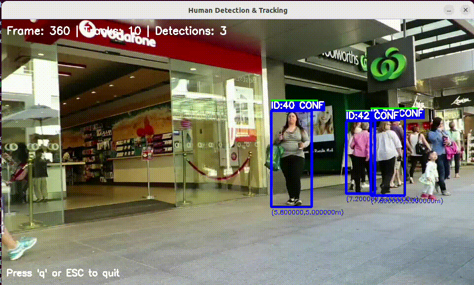
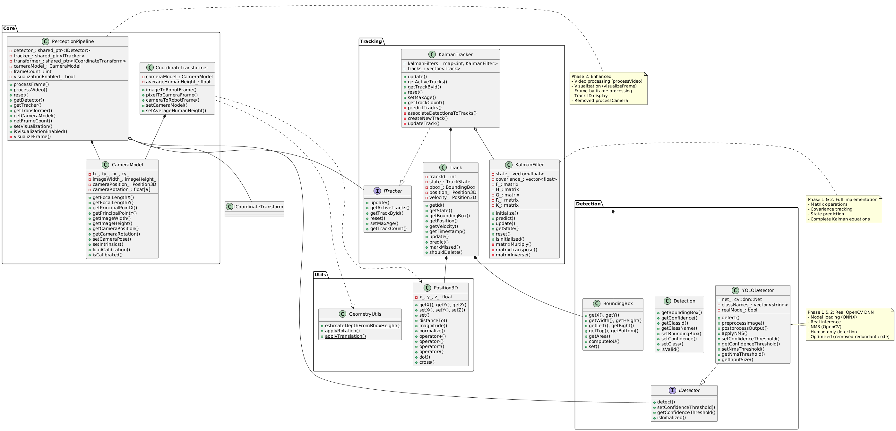
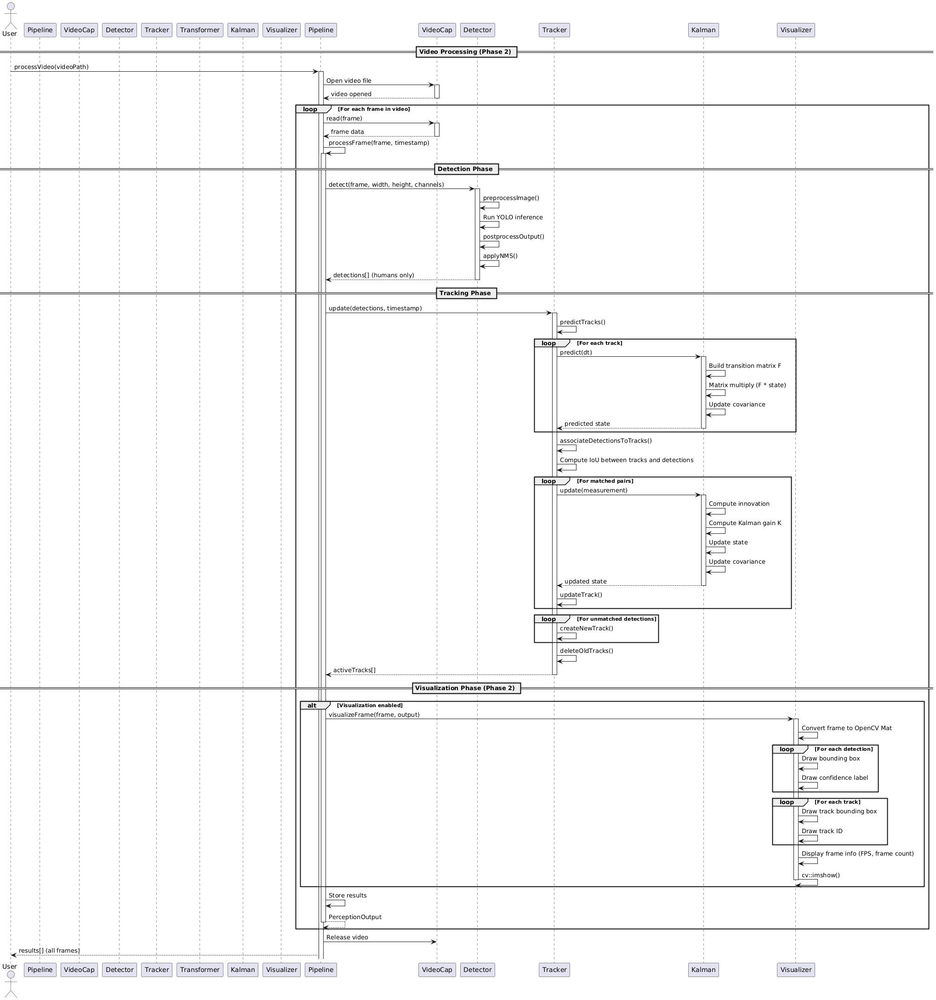
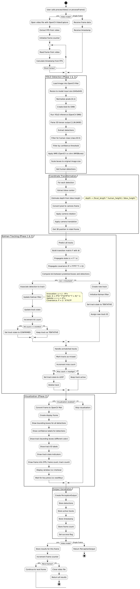

# Human Perception System (HPS)

 [](https://codecov.io/gh/rahulk-99/human-detector-tracker) [](LICENSE)

## Overview

The **Human Perception System (HPS)** is a modular C++17 robotics perception module designed for Acme Robotics. It detects and tracks humans (N≥1) in real-time using monocular camera input and outputs their 3D positions directly in the robot's reference frame.



*Real-time human detection and tracking with bounding boxes, track IDs, and frame information*

## Table of Contents

- [Main Features](#main-features)
- [Quick Start](#quick-start)
- [Architecture](#architecture)
- [Usage](#usage)
- [Testing](#testing)
- [UML Diagrams](#uml-diagrams)
- [Design Patterns](#design-patterns)
- [Project Documentation](#project-documentation)
- [Phase Status](#phase-status)
- [Algorithm Details](#algorithm-details)
- [Code Quality](#code-quality)
- [Troubleshooting](#troubleshooting)
- [Authors](#authors)

## Main Features

- **Human Detection**: YOLOv8-based detection with OpenCV DNN, configurable confidence thresholds, and NMS
- **Multi-Object Tracking**: Kalman Filter-based tracking with IoU data association and full covariance propagation
- **Video Processing**: Full video file processing with frame-by-frame detection and tracking
- **Visualization**: Real-time OpenCV-based visualization with bounding boxes, track IDs, and frame information
- **Coordinate Transformation**: Complete pixel-to-robot frame transformation with pinhole camera model
- **Depth Estimation**: Monocular depth estimation using bounding box height heuristic
- **Modular Architecture**: Clean interfaces following SOLID principles and design patterns
- **Comprehensive Testing**: 98 unit tests with 83%+ code coverage

## Quick Start

### Installation

1. **Download Required Files**:
   - Download video and model files from [Google Drive](https://drive.google.com/drive/folders/1EyaaiMVev9sIGax7qiCHixWLD2Pylc8X?usp=sharing)
   - Place video file in `data/` directory (e.g., `data/ADL-Rundle-6-raw.mp4`)
   - Place YOLO model in `models/` directory (e.g., `models/yolov8n.onnx`)

2. **Build the Project**:
   ```bash
   # Clone the repository
   git clone https://github.com/rahulk-99/human-detector-tracker.git
   cd human-detector-tracker

   # Configure and build
   cmake -S ./ -B build/
   cmake --build build/

   # Run the application
   ./build/app/shell-app --video data/ADL-Rundle-6-raw.mp4 models/yolov8n.onnx
   ```

### Dependencies

- **C++17 compliant compiler** (GCC 7+, Clang 5+, MSVC 2017+)
- **CMake 3.14+**
- **OpenCV 4.8+** (tested with 4.10.0) - required for YOLO inference
- **GoogleTest** (fetched automatically by CMake)
- **ONNX models** (YOLOv5/YOLOv8 ONNX format recommended)

## Architecture

The system is organized into four main modules:

- **Detection Module**: `IDetector` interface, `YOLODetector` implementation, `Detection` and `BoundingBox` classes
- **Tracking Module**: `ITracker` interface, `KalmanTracker` with `KalmanFilter`, `Track` lifecycle management
- **Core Module**: `PerceptionPipeline` (facade), `CameraModel`, `CoordinateTransformer`
- **Utils Module**: `Position3D`, `GeometryUtils`

### Implementation Highlights

**Phase 1**:
- Real YOLO detection with OpenCV DNN (ONNX/PyTorch support)
- Complete Kalman filter with matrix operations (6x6 state, full covariance)
- Enhanced coordinate transformation with depth estimation
- Non-maximum suppression (NMS) using IoU

**Phase 2**:
- Video file processing (`processVideo`) with OpenCV VideoCapture
- OpenCV-based visualization with bounding boxes, track IDs, and frame information
- Code optimization and redundancy removal (~433 lines removed)
- Comprehensive test coverage (98 tests, 83%+ code coverage)

## Usage

### Process Video File

```bash
./build/app/shell-app --video data/video.mp4 models/yolov8n.onnx
```

### Enable Visualization

The visualization is enabled by default during video processing. It displays:
- Bounding boxes for detections
- Track IDs and states
- Frame information (FPS, frame count, track count)

## Testing

### Run All Tests

```bash
cd build/
ctest --verbose
```

### Run Specific Test Suite

```bash
./build/test/cpp-test --gtest_filter=BoundingBoxTest.*
```

### Test Coverage

The project achieves **83%+ code coverage** with 98 comprehensive tests covering:
- Detection, tracking, and coordinate transformation
- Video processing and visualization
- Error handling and edge cases
- All public methods and interfaces

## UML Diagrams

### Phase 2 Diagrams (Current)

**Class Diagram** - Shows complete class hierarchy, interfaces, and relationships with Phase 2 enhancements.



See: [`UML/revised_phase2/class_diagram_revised.pdf`](./UML/revised_phase2/class_diagram_revised.pdf)

**Sequence Diagram** - Illustrates video processing workflow with detection, tracking, and visualization.



See: [`UML/revised_phase2/sequence_diagram_revised.pdf`](./UML/revised_phase2/sequence_diagram_revised.pdf)

**Activity Diagram** - Depicts the complete perception pipeline decision flow including video processing and visualization.



See: [`UML/revised_phase2/activity_diagram_revised.pdf`](./UML/revised_phase2/activity_diagram_revised.pdf)

### Phase 1 Diagrams (Historical)

For reference, Phase 1 diagrams are available in [`UML/revised_phase1/`](./UML/revised_phase1/).

### Generate Diagrams

```bash
# Install PlantUML
sudo apt-get install plantuml graphviz

# Generate PNG from PlantUML files (Phase 2)
plantuml UML/revised_phase2/*.puml

# Generate PDF from PNG (optional)
convert UML/revised_phase2/*.png UML/revised_phase2/*.pdf
```

## Design Patterns

- **Strategy Pattern**: `IDetector`, `ITracker`, `ICoordinateTransform` interfaces
- **Facade Pattern**: `PerceptionPipeline` as single entry point
- **RAII Pattern**: Smart pointers for automatic memory management
- **Pimpl Idiom**: `YOLODetector::Impl` for implementation hiding

## Project Documentation

**Phase 2**:
- [Phase 2 Video & Documentation](https://drive.google.com/drive/folders/1EyaaiMVev9sIGax7qiCHixWLD2Pylc8X?usp=sharing)
- [Product Backlog (AIP Sheet)](https://docs.google.com/spreadsheets/d/1wcmKYTpv4yeAv1NeTeLlhB47EcRxOFroaWx42daGazo/edit?usp=sharing)

**Phase 1**:
- [Phase 1 API Video](https://drive.google.com/file/d/1t2W6wct0taBPDg3CrEwSaJRvRWU8mBnN/view?usp=sharing)
- [Sprint Planning Notes](https://docs.google.com/document/d/1IPIIQfQ-b3CGt2YbmqxJesh1Z4LAwaoxIcWlEhEjiBU/edit?usp=sharing)

**Phase 0**:
- [Proposal Document, QuadChart & Video](https://drive.google.com/drive/folders/15M2WV5y34R-rcf8K7gPXKGJ_NX8htvk3?usp=sharing)

## Phase Status

### Phase 0 ✅ | Phase 1 ✅ | Phase 2 ✅

**Phase 0**: Complete class structure, interfaces, stub implementations, comprehensive test structure

**Phase 1**: Real YOLO implementation, full Kalman filter, coordinate transformation, OpenCV integration, CI/CD pipeline

**Phase 2**: Video processing, visualization, code optimization, expanded test coverage, LCOV integration

## Algorithm Details

### Depth Estimation

Monocular depth estimation using bounding box height:
```
depth = (focal_length * average_human_height) / bbox_height_pixels
```

### Kalman Filter

State vector: `[x, y, z, vx, vy, vz]` (position and velocity in 3D)

- Motion model: Constant velocity with full matrix operations
- Complete matrix operations: multiply, transpose, inverse (Gauss-Jordan)
- Full covariance propagation (6x6 matrix)

### Data Association

Uses IoU (Intersection over Union) matching:
- Compute IoU between predicted track boxes and detected boxes
- Match pairs with IoU > threshold (default 0.3)
- Greedy assignment (currently implemented)

## Code Quality

### Style Guide

Follows [Google C++ Style Guide](https://google.github.io/styleguide/cppguide.html):
- Classes: CamelCase
- Functions: camelCase
- Member variables: trailing underscore (`variable_`)
- Constants: kConstantName

### Static Analysis

```bash
cppcheck --enable=all --error-exitcode=1 --std=c++14 \
  --suppress=syntaxError:libs/perception/detection/YOLODetector.cpp:481 \
  --suppress=unusedFunction:test/error_handling_test.cpp:71 \
  -I include/ $(find . -name "*.cpp" | grep -v "/build/")
```

**Note**: The syntax error in `YOLODetector.cpp:481` is a false positive from cppcheck's preprocessor parsing. The `SetUp()` function in `error_handling_test.cpp:71` is used by GoogleTest framework automatically.

## Troubleshooting

### OpenCV Version Issues

If CMake can't find OpenCV or version is < 4.8:
```bash
# Check current version
pkg-config --modversion opencv4

# Build from source (recommended)
wget https://github.com/opencv/opencv/archive/refs/tags/4.10.0.zip
unzip opencv-4.10.0.zip
cd opencv-4.10.0 && mkdir build && cd build
cmake -D CMAKE_BUILD_TYPE=Release -D CMAKE_INSTALL_PREFIX=/usr/local ..
make -j$(nproc) && sudo make install
sudo ldconfig
```

## Authors

**Acme Robotics Development Team**
- Rahul Kumar
- Venkata Madhav Tadavarthi

**Course**: ENPM700 - Software Development for Robotics  
**Institution**: University of Maryland  
**Semester**: Fall 2025

## License

This project is licensed under the MIT License - see the [LICENSE](LICENSE) file for details.

## Acknowledgments

- YOLOv8 by [Ultralytics](https://github.com/ultralytics/ultralytics)
- GoogleTest framework
- Template structure from [cpp-boilerplate-v2](https://github.com/TommyChangUMD/cpp-boilerplate-v2)

## References

1. Bewley, A., et al. "Simple Online and Realtime Tracking" (SORT Algorithm)
2. Kalman, R. E. "A New Approach to Linear Filtering and Prediction Problems" (1960)
3. Redmon, J., et al. "You Only Look Once: Unified, Real-Time Object Detection"
4. OpenCV Documentation: https://docs.opencv.org/

---

**Project Status**: Phase 0 Complete ✅ | Phase 1 Complete ✅ | Phase 2 Complete ✅

For questions or issues, please open a [GitHub issue](https://github.com/rahulk-99/human-detector-tracker/issues).
